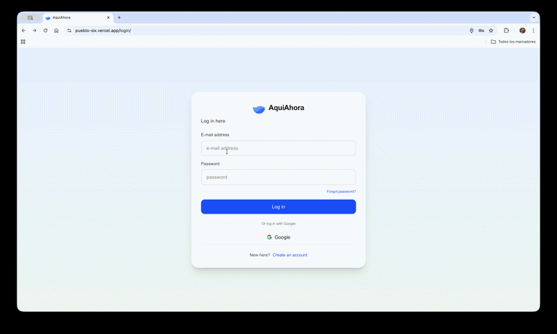

# Pueblo (AquiAhora) 📍

A modern location-based journaling web application that allows users to create and manage journal entries tied to specific municipalities. Built with Next.js 16, deployed on Vercel, and wrapped with Capacitor for native mobile experiences.

**🌐 Live Demo:** [https://pueblo-six.vercel.app/](https://pueblo-six.vercel.app/)



## 📱 Overview

Pueblo (also known as AquiAhora) is a responsive web application that enables users to:
- **Journal by Location** - Create entries associated with specific municipalities
- **Interactive Map** - Visual representation of nearby locations using Leaflet
- **Secure Authentication** - Login/logout with Supabase Auth
- **Real-Time Sync** - Automatic data synchronization with Supabase backend
- **Cross-Platform** - Works on web, iOS, and Android via Capacitor
- **Modern State Management** - TanStack Query for server state, Zustand for UI state

---

## ✨ Features

### Core Functionality
- ✅ **User Authentication** - Secure login and logout
- ✅ **Create Entries** - Add journal entries with title and description
- ✅ **View Entries** - Browse complete entry history
- ✅ **Location-Based** - Entries tied to specific municipalities
- ✅ **Interactive Maps** - Leaflet maps showing nearby locations
- ✅ **Real-Time Updates** - Live data synchronization with Supabase
- ✅ **Responsive Design** - Works seamlessly on mobile, tablet, and desktop

### User Experience
- 🎨 Modern, clean UI with Tailwind CSS
- 🗺️ Interactive map visualization
- 📱 Mobile-first responsive design
- ⚡ Fast page loads with Next.js App Router
- 🔄 Smart caching and background sync with TanStack Query
- 💾 Optimistic UI updates with Zustand
- 🌍 Geolocation support via Capacitor

---

## 🏗️ Architecture

### Technology Stack

**Frontend Framework**
- **Next.js 16.1.1** - React framework with App Router
- **React 19.2.0** - Latest React with concurrent features
- **TypeScript 5** - Type-safe development

**State Management**
- **TanStack Query (React Query)** - Server state management with automatic caching and synchronization
- **Zustand** - Lightweight client state management
- **Redux Toolkit 2.10.1** - Predictable state container (legacy, being migrated)
- **React Redux 9.2.0** - Official React bindings for Redux

**Backend & Database**
- **Supabase** - Backend-as-a-Service
  - PostgreSQL database
  - Real-time subscriptions
  - Row Level Security (RLS)
  - Built-in authentication

**Styling**
- **Tailwind CSS 4** - Utility-first CSS framework
- **PostCSS** - CSS transformations

**Maps & Geolocation**
- **Leaflet 1.9.4** - Interactive maps library
- **React Leaflet 5.0.0** - React components for Leaflet
- **Capacitor Geolocation 7.1.5** - Native geolocation API

**Mobile Integration**
- **Capacitor 7.4.4** - Cross-platform native runtime
  - iOS support
  - Android support
  - Web support (PWA)

**Package Manager**
- **Bun** - Fast JavaScript runtime and package manager

---

## 📦 Project Structure

```
pueblo/
├── app/                              # Next.js App Router
│   ├── layout.tsx                    # Root layout
│   ├── page.tsx                      # Home page
│   ├── login/                        # Login page
│   ├── entries/                      # Entries page
│   └── providers.tsx                 # Redux Provider
│
├── components/                       # React components
│   ├── EntryForm.tsx                 # Create entry form
│   ├── EntryList.tsx                 # List of entries
│   ├── LocationPicker.tsx            # Municipality selector
│   ├── Map.tsx                       # Leaflet map component
│   └── Navbar.tsx                    # Navigation bar
│
├── lib/                              # Core utilities
│   ├── supabase/
│   │   └── client.ts                 # Supabase client setup
│   │
│   ├── queries/                      # TanStack Query hooks
│   │   ├── client.ts                 # QueryClient configuration
│   │   ├── keys.ts                   # Query key factory
│   │   ├── useMunicipiosQuery.ts     # Municipios queries
│   │   ├── useEntriesQuery.ts        # Entries queries
│   │   └── useSession.ts             # Auth session query
│   │
│   ├── store/                        # Zustand stores
│   │   └── useAppStore.ts            # UI state (selected municipio, sidebar)
│   │
│   ├── platform/                     # Platform utilities
│   │   ├── location.ts               # Geolocation helpers
│   │   └── storage.ts                # Local storage wrapper
│   │
│   └── types.ts                      # TypeScript types
│
├── public/                           # Static assets
│   └── images/                       # Image files
│
├── android/                          # Android Capacitor project
├── ios/                              # iOS Capacitor project
│
├── capacitor.config.ts               # Capacitor configuration
├── next.config.ts                    # Next.js configuration
├── tailwind.config.ts                # Tailwind CSS configuration
├── tsconfig.json                     # TypeScript configuration
└── package.json                      # Project dependencies
```

---

## 🚀 Getting Started

### Prerequisites

- **Node.js 20+** or **Bun 1.0+**
- **Git**
- **Supabase Account** - [Sign up for free](https://supabase.com)
- **Xcode** (for iOS development) - macOS only
- **Android Studio** (for Android development)

### Installation

#### 1. Clone the repository

```bash
git clone https://github.com/yourusername/pueblo.git
cd pueblo
```

#### 2. Install dependencies

```bash
# Using Bun (recommended)
bun install

# Or using npm
npm install
```

#### 3. Configure Supabase

Create a `.env.local` file in the root directory:

```env
NEXT_PUBLIC_SUPABASE_URL=https://your-project.supabase.co
NEXT_PUBLIC_SUPABASE_ANON_KEY=your-anon-key-here
```

Get your credentials from: [Supabase Dashboard](https://app.supabase.com) → Project Settings → API

#### 4. Set up Supabase Database

Run this SQL in your Supabase SQL Editor:

```sql
-- Enable required extensions
CREATE EXTENSION IF NOT EXISTS "uuid-ossp";

-- Create municipios table
CREATE TABLE municipios (
  id TEXT PRIMARY KEY,
  name TEXT NOT NULL,
  province TEXT NOT NULL,
  latitude DOUBLE PRECISION NOT NULL,
  longitude DOUBLE PRECISION NOT NULL,
  created_at TIMESTAMPTZ NOT NULL DEFAULT NOW()
);

-- Create entries table
CREATE TABLE "Entries" (
  id BIGSERIAL PRIMARY KEY,
  user_id UUID REFERENCES auth.users(id) NOT NULL,
  entry_date TEXT NOT NULL,
  title TEXT NOT NULL,
  description TEXT,
  municipio_id TEXT REFERENCES municipios(id) NOT NULL,
  created_at TIMESTAMPTZ NOT NULL DEFAULT NOW(),
  updated_at TIMESTAMPTZ NOT NULL DEFAULT NOW()
);

-- Enable Row Level Security
ALTER TABLE municipios ENABLE ROW LEVEL SECURITY;
ALTER TABLE "Entries" ENABLE ROW LEVEL SECURITY;

-- Municipios policies (public read)
CREATE POLICY "Municipios are viewable by everyone"
  ON municipios FOR SELECT
  USING (true);

-- Entries policies (user-specific)
CREATE POLICY "Users can view their own entries"
  ON "Entries" FOR SELECT
  USING (auth.uid() = user_id);

CREATE POLICY "Users can create their own entries"
  ON "Entries" FOR INSERT
  WITH CHECK (auth.uid() = user_id);

CREATE POLICY "Users can update their own entries"
  ON "Entries" FOR UPDATE
  USING (auth.uid() = user_id);

CREATE POLICY "Users can delete their own entries"
  ON "Entries" FOR DELETE
  USING (auth.uid() = user_id);

-- Create indexes for performance
CREATE INDEX entries_user_id_idx ON "Entries"(user_id);
CREATE INDEX entries_municipio_id_idx ON "Entries"(municipio_id);
CREATE INDEX entries_created_at_idx ON "Entries"(created_at DESC);

-- Create updated_at trigger
CREATE OR REPLACE FUNCTION update_updated_at_column()
RETURNS TRIGGER AS $$
BEGIN
   NEW.updated_at = NOW();
   RETURN NEW;
END;
$$ language 'plpgsql';

CREATE TRIGGER update_entries_updated_at 
  BEFORE UPDATE ON "Entries"
  FOR EACH ROW
  EXECUTE FUNCTION update_updated_at_column();

-- RPC function to get latest entries
CREATE OR REPLACE FUNCTION ultimas_entradas()
RETURNS TABLE (
  id bigint,
  entry_date text,
  title text,
  description text,
  municipio_id text,
  user_id uuid
) 
LANGUAGE plpgsql SECURITY DEFINER
AS $$
BEGIN
  RETURN QUERY
  SELECT e.id, e.entry_date, e.title, e.description, e.municipio_id, e.user_id
  FROM "Entries" e
  WHERE e.user_id = auth.uid()
  ORDER BY e.entry_date DESC LIMIT 50;
END;
$$;

-- RPC function to insert entry
CREATE OR REPLACE FUNCTION insert_entry(
  title text,
  description text,
  entry_date text,
  municipio_id text
)
RETURNS void LANGUAGE plpgsql SECURITY DEFINER
AS $$
BEGIN
  INSERT INTO "Entries" (title, description, entry_date, municipio_id, user_id)
  VALUES (title, description, entry_date, municipio_id, auth.uid());
END;
$$;
```

#### 5. Seed Municipios Data (Optional)

You can add sample municipalities data via the Supabase dashboard or API.

#### 6. Run Development Server

```bash
# Using Bun
bun dev

# Or using npm
npm run dev
```

Open [http://localhost:3000](http://localhost:3000) in your browser.

---

## 📱 Mobile Development (Capacitor)

### Setup for iOS

```bash
# Sync web build to iOS
bun run cap:sync

# Open in Xcode
bun run cap:open:ios
```

**Requirements:**
- macOS
- Xcode 15+
- CocoaPods

### Setup for Android

```bash
# Sync web build to Android
bun run cap:sync

# Open in Android Studio
bun run cap:open:android
```

**Requirements:**
- Android Studio
- Android SDK 33+
- Java Development Kit (JDK) 17+

### Build for Production

```bash
# 1. Build Next.js app
bun run build

# 2. Sync with Capacitor
bun run cap:sync

# 3. Open in native IDE
bun run cap:open:ios     # For iOS
bun run cap:open:android # For Android
```

---

## 🌐 Deployment

### Deploy to Vercel (Current)

**Already deployed at:** [https://pueblo-six.vercel.app/](https://pueblo-six.vercel.app/)

```bash
# Install Vercel CLI
npm i -g vercel

# Deploy
vercel

# Production deployment
vercel --prod
```

### Environment Variables in Vercel

Add these in Vercel Dashboard → Project Settings → Environment Variables:

```
NEXT_PUBLIC_SUPABASE_URL=your-supabase-url
NEXT_PUBLIC_SUPABASE_ANON_KEY=your-supabase-key
```

### Deploy to Other Platforms

The app uses `output: 'export'` for static export, making it compatible with:
- **Netlify** - Static site hosting
- **GitHub Pages** - Static site hosting
- **AWS S3 + CloudFront** - Static site hosting
- **Firebase Hosting** - Google's hosting platform

---

## 🎯 Usage Guide

### 1. **Sign Up / Login**
- Visit [https://pueblo-six.vercel.app/](https://pueblo-six.vercel.app/)
- Click "Login" in the navigation
- Sign up with email or login with existing account

### 2. **Create Your First Entry**
- After logging in, you'll see the main dashboard
- Select a municipality from the location picker
- Click "Add Entry" or "+" button
- Fill in:
  - **Date** - When this entry occurred
  - **Title** - Brief description
  - **Description** - Detailed notes (optional)
- Click "Save"

### 3. **View Your Entries**
- All entries appear in the main list
- Entries are organized by date
- Each entry shows:
  - Date
  - Title
  - Municipality
  - Description preview

### 4. **Interactive Map**
- View nearby municipalities on the map
- Click markers to see municipality details
- Map shows your current location (if permissions granted)

### 5. **Logout**
- Click your profile icon or "Logout" button
- Your session is securely cleared

---

## 🔐 Security Features

- ✅ **Row Level Security (RLS)** - Users can only access their own data
- ✅ **Authentication Required** - All operations require valid session
- ✅ **HTTPS Only** - All communication encrypted via Vercel/Supabase
- ✅ **No API Keys in Code** - Environment variables for sensitive data
- ✅ **Input Validation** - Client and server-side validation
- ✅ **SQL Injection Protection** - Prepared statements via Supabase
- ✅ **XSS Protection** - React's built-in escaping

---

## 🎨 Styling & Theming

### Tailwind CSS 4

The app uses the latest Tailwind CSS with modern features:

```css
/* Example utility classes */
.responsive-container {
  @apply container mx-auto px-4;
}

.card {
  @apply bg-white rounded-lg shadow-md p-6;
}

.btn-primary {
  @apply bg-blue-600 hover:bg-blue-700 text-white font-medium py-2 px-4 rounded;
}
```

### Responsive Design

```
Mobile-first approach:
- Base: Mobile (<640px)
- sm: Tablet (≥640px)
- md: Small laptop (≥768px)
- lg: Desktop (≥1024px)
- xl: Large desktop (≥1280px)
```

---

## 📊 State Management

### Modern Architecture: TanStack Query + Zustand

The application uses a modern state management approach:

**TanStack Query (React Query)** - Server State
- Automatic caching and background synchronization
- Handles municipios and entries data
- Optimistic updates for better UX
- Automatic refetching and cache invalidation

**Zustand** - Client State  
- Lightweight store for UI state
- Selected municipality
- Sidebar open/closed state
- User preferences

**Redux Toolkit** - Legacy (being migrated)
- Currently still in use
- Gradual migration to TanStack Query + Zustand

### Store Structure

```typescript
// TanStack Query (Server State)
{
  queries: {
    'municipios': QueryState<Municipio[]>,
    'entries': QueryState<Entry[]>,
    'entries-user': QueryState<Entry[]>
  }
}

// Zustand (Client State)
{
  selectedMunicipio: Municipio | null,
  sidebarOpen: boolean,
  setSelectedMunicipio: (municipio: Municipio | null) => void,
  toggleSidebar: () => void
}
```

### Usage Examples

**TanStack Query for Server Data:**
```typescript
// Fetch entries with automatic caching
const { data: entries, isLoading } = useEntriesQuery()

// Create entry with optimistic update
const { mutate: createEntry } = useCreateEntryMutation()

createEntry({ title, description, municipio_id })
```

**Zustand for UI State:**
```typescript
// Access and update UI state
const selectedMunicipio = useAppStore((state) => state.selectedMunicipio)
const setSelectedMunicipio = useAppStore((state) => state.setSelectedMunicipio)

// Update selected municipality
setSelectedMunicipio(municipio)
```

### Key Patterns

```typescript
// Async data fetching with TanStack Query
const { data, isLoading, error } = useQuery({
  queryKey: ['entries'],
  queryFn: fetchEntries,
  staleTime: 5 * 60 * 1000, // 5 minutes
})

// Mutations with optimistic updates
const { mutate } = useMutation({
  mutationFn: createEntry,
  onMutate: async (newEntry) => {
    // Optimistically update UI
    await queryClient.cancelQueries(['entries'])
    const previous = queryClient.getQueryData(['entries'])
    queryClient.setQueryData(['entries'], (old) => [...old, newEntry])
    return { previous }
  },
  onError: (err, newEntry, context) => {
    // Rollback on error
    queryClient.setQueryData(['entries'], context.previous)
  },
  onSettled: () => {
    // Refetch after mutation
    queryClient.invalidateQueries(['entries'])
  }
})

// Zustand for simple UI state
const useAppStore = create((set) => ({
  selectedMunicipio: null,
  setSelectedMunicipio: (municipio) => set({ selectedMunicipio: municipio }),
  sidebarOpen: true,
  toggleSidebar: () => set((state) => ({ sidebarOpen: !state.sidebarOpen }))
}))
```

---

## 🗺️ Maps Integration

### Leaflet Configuration

```typescript
// Default map settings
const defaultCenter: LatLng = [40.4637, -3.7492] // Madrid, Spain
const defaultZoom = 10

// Tile layer
https://{s}.tile.openstreetmap.org/{z}/{x}/{y}.png
```

### Geolocation

```typescript
// Get current position using Capacitor
import { Geolocation } from '@capacitor/geolocation'

const position = await Geolocation.getCurrentPosition()
```

---

## 🧪 Testing

### Run Linting

```bash
bun run lint
```

### Type Checking

```bash
tsc --noEmit
```

---

## 📈 Performance Optimizations

- ✅ **Static Export** - Pre-rendered HTML for fast initial loads
- ✅ **Code Splitting** - Automatic chunking via Next.js
- ✅ **Image Optimization** - Next.js Image component
- ✅ **TanStack Query Caching** - Intelligent server state caching and background sync
- ✅ **Zustand Efficiency** - Minimal re-renders with granular subscriptions
- ✅ **Lazy Loading** - Dynamic imports for heavy components
- ✅ **Service Worker** - Capacitor PWA support

---

## 🐛 Troubleshooting

### Common Issues

#### "Module not found" errors
```bash
# Clear cache and reinstall
rm -rf node_modules bun.lockb
bun install
```

#### Capacitor sync fails
```bash
# Ensure build exists first
bun run build
bun run cap:sync
```

#### Supabase connection errors
- Verify `.env.local` has correct credentials
- Check Supabase project is active
- Ensure RLS policies are created

#### Map not rendering
- Check Leaflet CSS is imported
- Verify coordinates are valid
- Check browser console for errors

---

## 🤝 Contributing

Contributions are welcome! Please follow these guidelines:

### How to Contribute

1. **Fork the repository**
2. **Create a feature branch**
   ```bash
   git checkout -b feature/amazing-feature
   ```
3. **Make your changes**
4. **Commit your changes**
   ```bash
   git commit -m 'Add amazing feature'
   ```
5. **Push to your fork**
   ```bash
   git push origin feature/amazing-feature
   ```
6. **Open a Pull Request**

### Code Standards

- ✅ Use TypeScript for type safety
- ✅ Follow ESLint rules
- ✅ Use Tailwind CSS for styling
- ✅ Write meaningful commit messages
- ✅ Test on mobile and desktop
- ✅ Update documentation as needed

---

## 📝 Roadmap

### Planned Features

- [ ] **Photo Attachments** - Add images to entries
- [ ] **Entry Editing** - Modify existing entries
- [ ] **Entry Deletion** - Remove unwanted entries
- [ ] **Search & Filter** - Find entries by date, location, or keyword
- [ ] **Export to PDF/CSV** - Download entry history
- [ ] **Dark Mode** - Toggle between light and dark themes
- [ ] **Entry Categories** - Tag entries with categories
- [ ] **Sharing** - Share entries with friends
- [ ] **Push Notifications** - Reminders and updates
- [ ] **Offline Mode** - Full offline functionality with sync
- [ ] **Multi-Language** - Spanish, English, and more

### Version History

**v0.1.0** (Current)
- ✅ User authentication (login/logout)
- ✅ Create journal entries
- ✅ View entry list
- ✅ Interactive map with Leaflet
- ✅ Responsive design
- ✅ Capacitor iOS/Android support
- ✅ Deployed to Vercel

---

## 📄 License

This project is licensed under the **MIT License**.

```
MIT License

Copyright (c) 2026 kebuenokebueno

Permission is hereby granted, free of charge, to any person obtaining a copy
of this software and associated documentation files (the "Software"), to deal
in the Software without restriction, including without limitation the rights
to use, copy, modify, merge, publish, distribute, sublicense, and/or sell
copies of the Software, and to permit persons to whom the Software is
furnished to do so, subject to the following conditions:

The above copyright notice and this permission notice shall be included in all
copies or substantial portions of the Software.

THE SOFTWARE IS PROVIDED "AS IS", WITHOUT WARRANTY OF ANY KIND, EXPRESS OR
IMPLIED, INCLUDING BUT NOT LIMITED TO THE WARRANTIES OF MERCHANTABILITY,
FITNESS FOR A PARTICULAR PURPOSE AND NONINFRINGEMENT. IN NO EVENT SHALL THE
AUTHORS OR COPYRIGHT HOLDERS BE LIABLE FOR ANY CLAIM, DAMAGES OR OTHER
LIABILITY, WHETHER IN AN ACTION OF CONTRACT, TORT OR OTHERWISE, ARISING FROM,
OUT OF OR IN CONNECTION WITH THE SOFTWARE OR THE USE OR OTHER DEALINGS IN THE
SOFTWARE.
```

---

## 👨‍💻 Author

**kebuenokebueno**
- GitHub: [@kebuenokebueno](https://github.com/kebuenokebueno)
- Live Demo: [pueblo-six.vercel.app](https://pueblo-six.vercel.app/)

---

## 🙏 Acknowledgments

- [Next.js](https://nextjs.org/) - React framework
- [Supabase](https://supabase.com/) - Backend and database
- [Vercel](https://vercel.com/) - Hosting and deployment
- [Capacitor](https://capacitorjs.com/) - Native mobile runtime
- [Leaflet](https://leafletjs.com/) - Interactive maps
- [Tailwind CSS](https://tailwindcss.com/) - Utility-first CSS
- [TanStack Query](https://tanstack.com/query) - Server state management
- [Zustand](https://zustand-demo.pmnd.rs/) - Client state management
- [Redux Toolkit](https://redux-toolkit.js.org/) - State management (legacy)
- [Bun](https://bun.sh/) - Fast JavaScript runtime

---

## 📚 Documentation & Resources

### Official Documentation
- [Next.js 16 Docs](https://nextjs.org/docs)
- [React 19 Docs](https://react.dev/)
- [Supabase Docs](https://supabase.com/docs)
- [Capacitor Docs](https://capacitorjs.com/docs)
- [Leaflet Docs](https://leafletjs.com/reference.html)
- [Tailwind CSS Docs](https://tailwindcss.com/docs)
- [TanStack Query Docs](https://tanstack.com/query/latest/docs/react/overview)
- [Zustand Docs](https://docs.pmnd.rs/zustand/getting-started/introduction)
- [Redux Toolkit Docs](https://redux-toolkit.js.org/introduction/getting-started)

### Tutorials & Guides
- [Building with Next.js App Router](https://nextjs.org/docs/app/building-your-application)
- [Supabase Authentication Guide](https://supabase.com/docs/guides/auth)
- [Capacitor iOS Setup](https://capacitorjs.com/docs/ios)
- [Capacitor Android Setup](https://capacitorjs.com/docs/android)

---

## 🎬 Demo

**Live Application:** [https://pueblo-six.vercel.app/](https://pueblo-six.vercel.app/)

Try it out on:
- 🌐 **Web Browser** - Desktop and mobile
- 📱 **iOS** - Build and install via Xcode
- 🤖 **Android** - Build and install via Android Studio

---

**⭐ If you found this project helpful, please give it a star!**

**🐛 Found a bug? [Open an issue](https://github.com/kebuenokebueno/pueblo/issues)**

**💡 Have a feature request? [Start a discussion](https://github.com/kebuenokebueno/pueblo/discussions)**

**📧 Questions? Reach out via [GitHub Issues](https://github.com/kebuenokebueno/pueblo/issues)**
